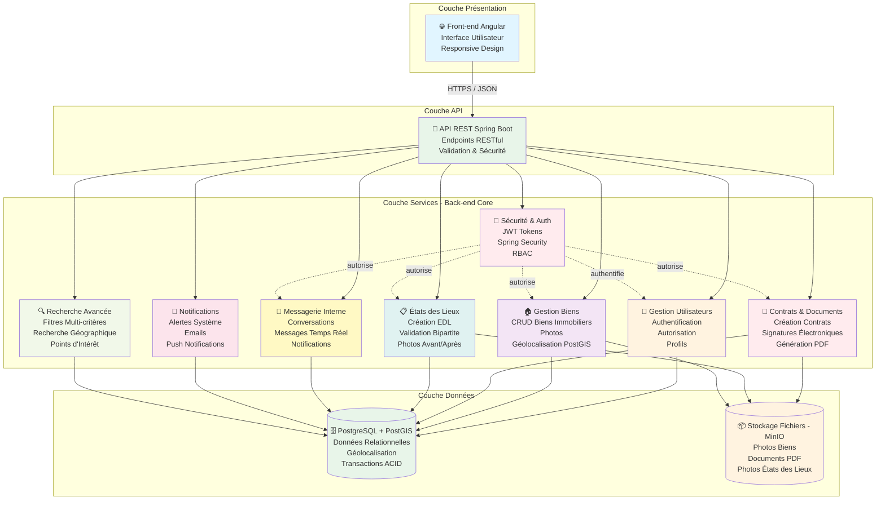
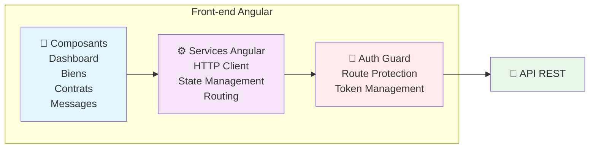
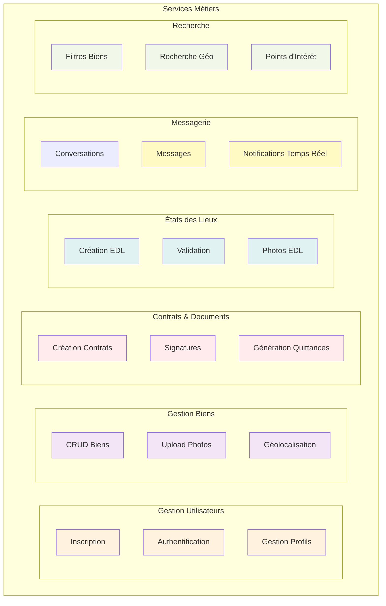
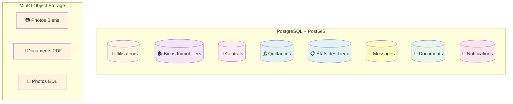
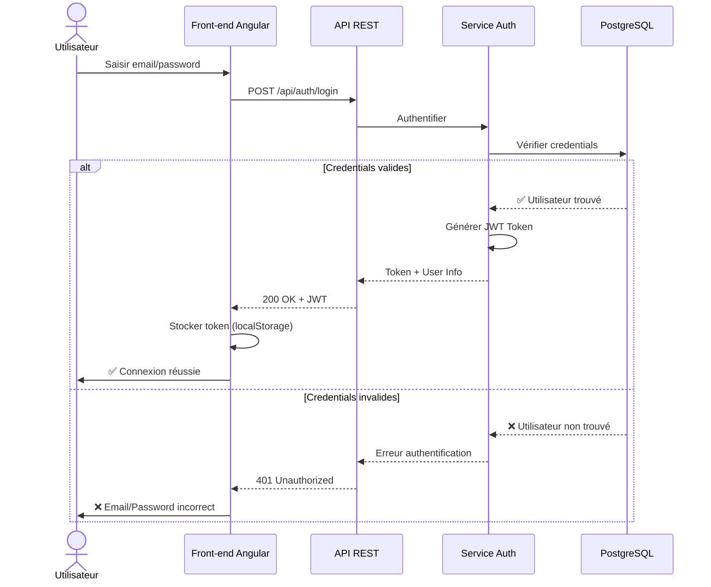
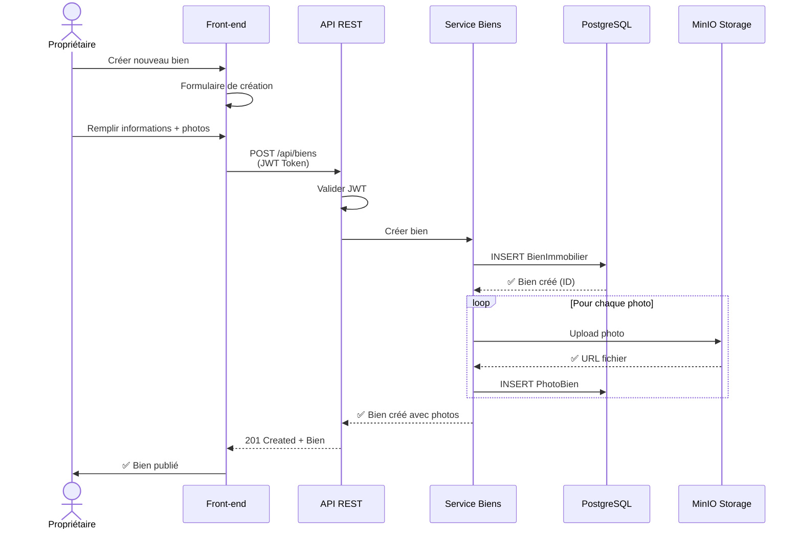
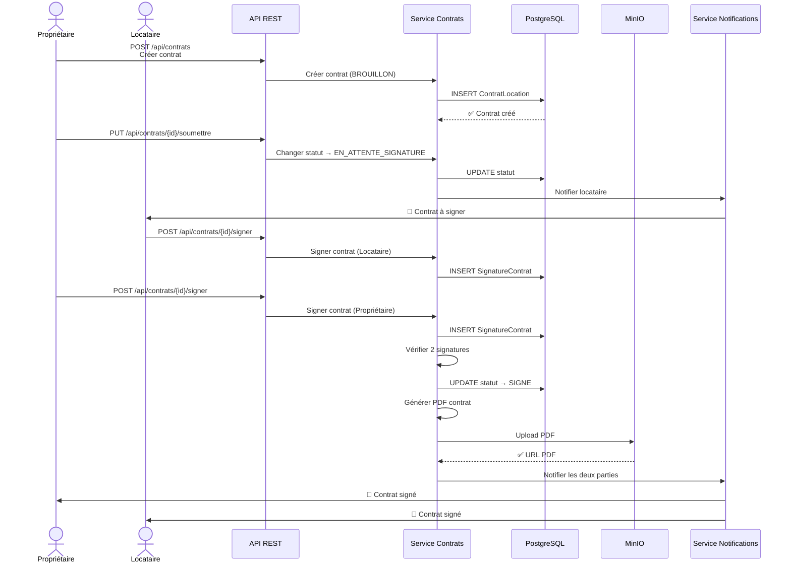
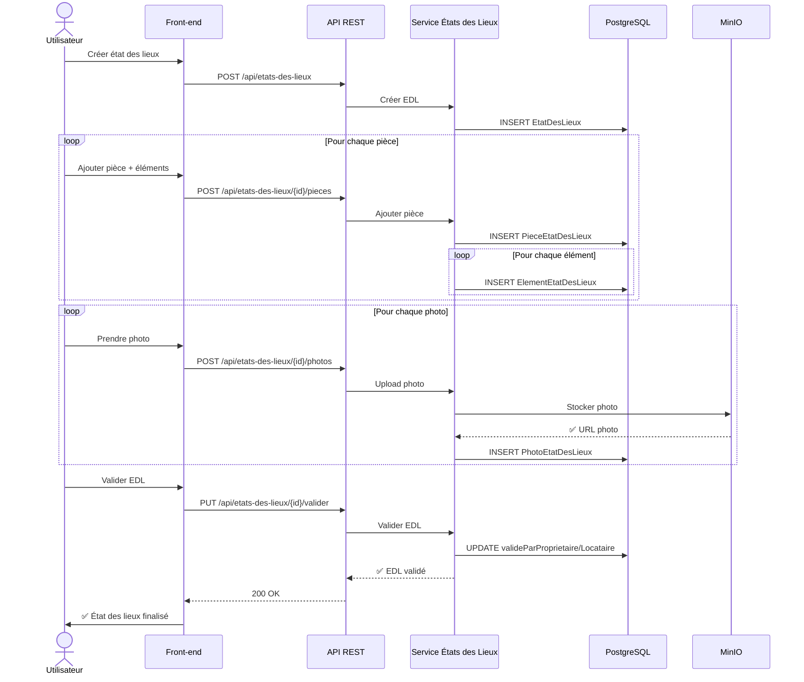
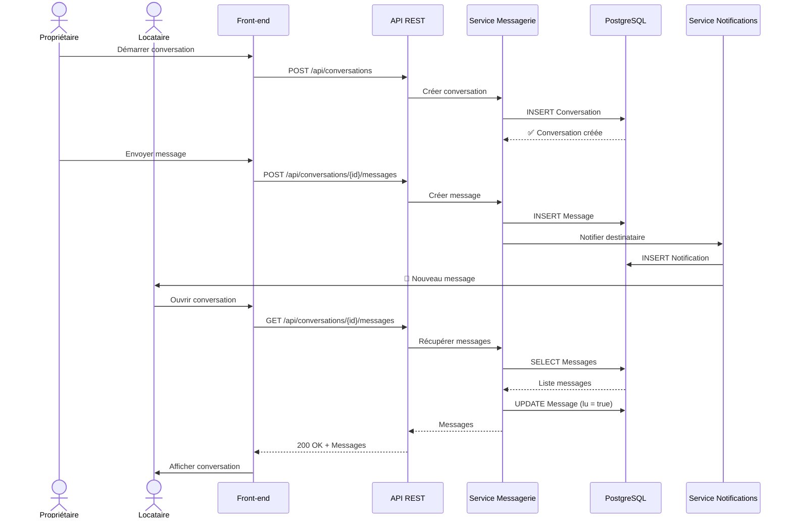
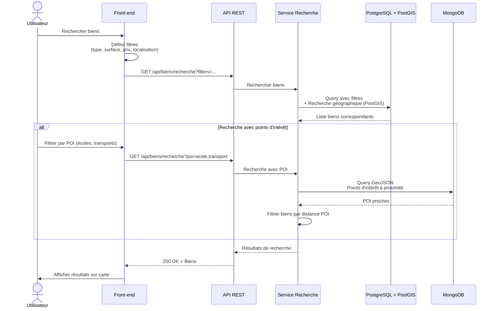

# 🏗️ RentSweet — Architecture Globale

## 📐 Vue d'Ensemble de l'Architecture

RentSweet est une plateforme de gestion locative complète permettant aux propriétaires et locataires de gérer leurs biens, contrats, documents et communications.

**Stack Technologique :**
- **Back-End :** Spring Boot
- **Front-End :** Angular

---

## 🎨 Architecture Globale



---

## 🔄 Architecture Détaillée par Couche

### 1. Couche Présentation



---

### 2. Couche Services Back-End



---

### 3. Couche Données



---

## 🔐 Flux d'Authentification



---

## 🏠 Flux de Création de Bien Immobilier



---

## 📄 Flux de Signature de Contrat



---

## 📋 Flux de Création d'État des Lieux



---

## 💬 Flux de Messagerie



---

## 🔍 Flux de Recherche Avancée



---

## 🛠️ Stack Technologique

### Front-End
```
Angular 17+
TypeScript
Angular Material
Leaflet (Cartes interactives)
RxJS (Reactive Programming)
```

### Back-End
```
Spring Boot 3.x
Java 17+
Spring Security + JWT
Spring Data JPA
Spring Data MongoDB
```

### Bases de Données
```
PostgreSQL 15+ (Données relationnelles)
PostGIS (Extension géospatiale)
MongoDB 7+ (Points d'intérêt)
```

### Stockage Fichiers
```
MinIO (Object Storage compatible S3)
```

### Infrastructure
```
Docker
Docker Compose
Nginx (Reverse Proxy)
```

---

## 📊 Composants Principaux

| Composant | Technologie | Rôle |
|-----------|-------------|------|
| **Front-end** | Angular | Interface utilisateur responsive |
| **API REST** | Spring Boot | Endpoints RESTful, validation |
| **Authentification** | Spring Security + JWT | Sécurité, gestion sessions |
| **Base relationnelle** | PostgreSQL + PostGIS | Données métier + géolocalisation |
| **Stockage fichiers** | MinIO | Photos, documents PDF |
| **Notifications** | Spring Events | Alertes temps réel |

---

## 🔐 Sécurité

### Authentification & Autorisation
- **JWT Tokens** : Authentification stateless
- **Spring Security** : Protection des endpoints
- **RBAC** : Contrôle d'accès basé sur les rôles (PROPRIETAIRE, LOCATAIRE)
- **HTTPS** : Chiffrement des communications

### Protection des Données
- **Validation** : Bean Validation (JSR-303)
- **Sanitization** : Protection XSS
- **CORS** : Configuration stricte
- **Rate Limiting** : Protection contre abus

---

## 📈 Fonctionnalités Principales

### Pour les Propriétaires
- ✅ Gestion des biens immobiliers
- ✅ Création et signature de contrats
- ✅ Génération automatique de quittances
- ✅ États des lieux numériques
- ✅ Messagerie avec locataires
- ✅ Tableau de bord analytique

### Pour les Locataires
- ✅ Recherche de biens avec filtres avancés
- ✅ Visualisation sur carte interactive
- ✅ Signature électronique de contrats
- ✅ Téléchargement de quittances
- ✅ États des lieux collaboratifs
- ✅ Communication avec propriétaire

---

## 🎯 Avantages de l'Architecture

### Scalabilité
- Architecture modulaire (services indépendants)
- Base de données optimisée (PostgreSQL + MongoDB)
- Stockage distribué (MinIO)

### Performance
- Cache applicatif
- Requêtes optimisées (indexes, PostGIS)
- Lazy loading des données

### Maintenabilité
- Code structuré (Clean Architecture)
- Tests unitaires et d'intégration
- Documentation API (Swagger/OpenAPI)

### Sécurité
- Authentification robuste (JWT)
- Autorisation fine (RBAC)
- Validation des données
- Chiffrement HTTPS

---

## 📝 Conclusion

RentSweet offre une architecture **moderne, sécurisée et scalable** pour la gestion locative :

- ✅ **Séparation claire** des responsabilités (Angular / Spring Boot)
- ✅ **Multi-base de données** (PostgreSQL + MongoDB) pour performances optimales
- ✅ **Géolocalisation avancée** avec PostGIS
- ✅ **Stockage distribué** avec MinIO
- ✅ **Sécurité renforcée** avec Spring Security + JWT
- ✅ **Expérience utilisateur fluide** avec Angular Material

Cette architecture garantit une plateforme **performante, fiable et évolutive** pour tous les acteurs de la location immobilière.
